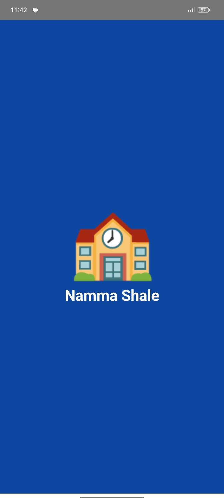
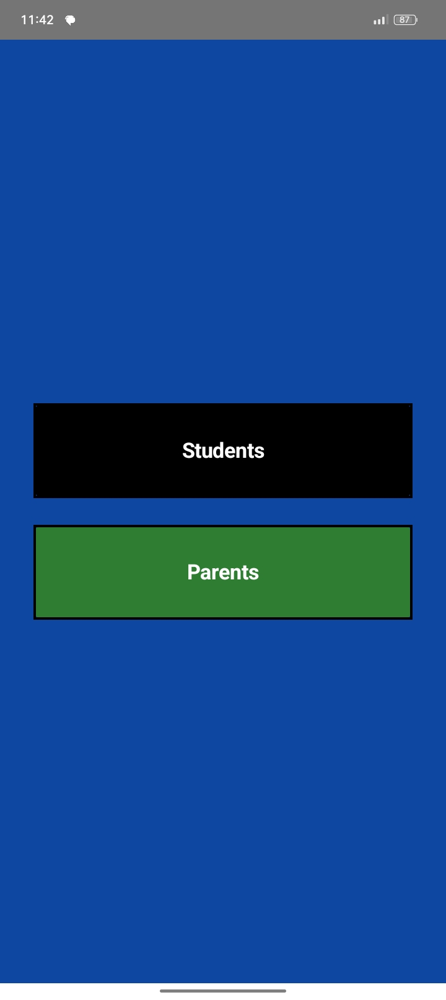
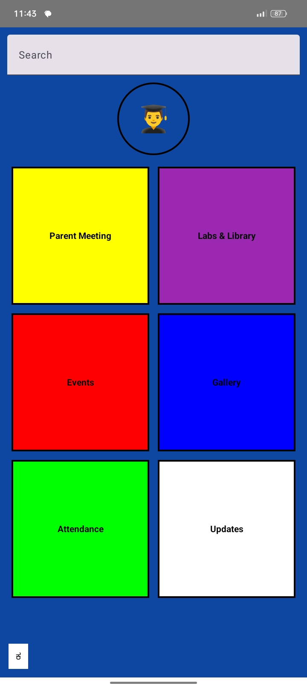
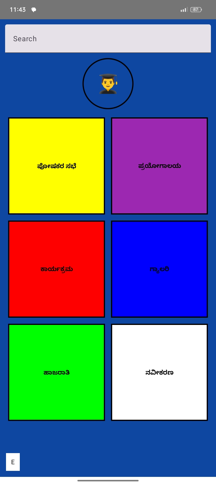
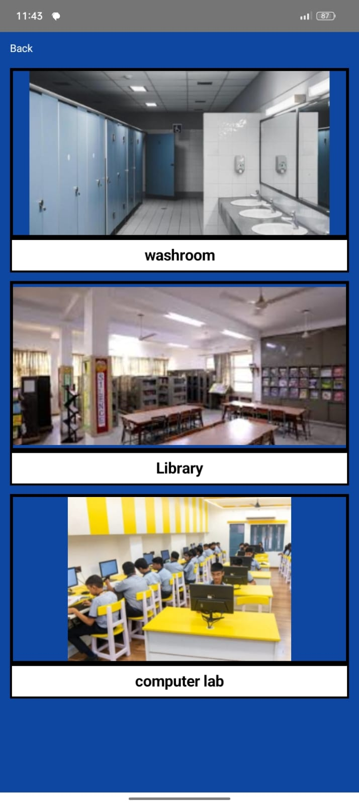
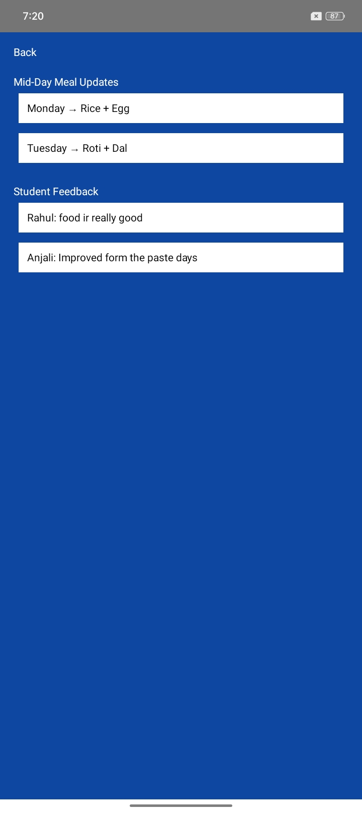
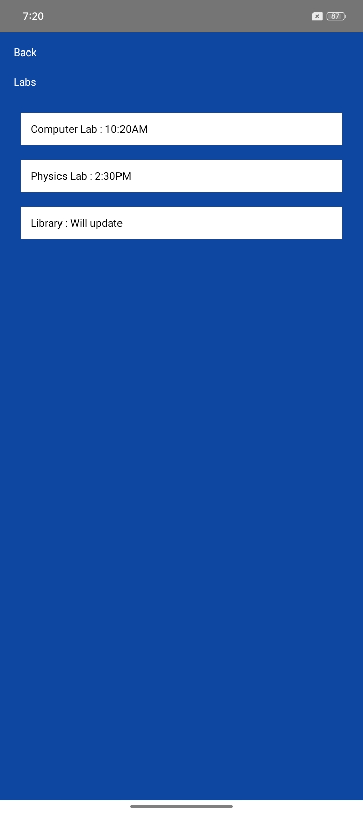
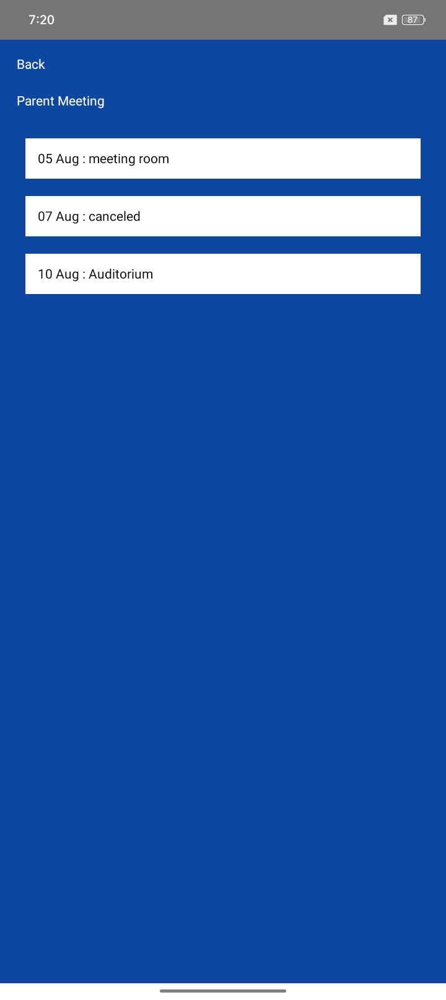

# Namma Shale

Namma Shale is a smart school management Android application developed using Kotlin and Jetpack Compose.

## Features
- Student and Parent Login
- Dashboard Navigation
- Attendance Section
- Events Section
- Gallery with Images
- Kannada and English Support
- Login Validation
- Animated Screens

## Technologies Used
- Kotlin
- Android Studio
- Jetpack Compose
- SharedPreferences

## Project Objective
The main goal of this application is to improve communication between schools, students, and parents through a digital platform.

## Screenshots
Screenshots added below.
 ## App Screenshots

### Screen 1 – Namma Shale Welcome Screen

### Screen 2 – Student and Parent Selection Screen

### Screen 3 – Student Login Screen
.png)

### Screen 4 – Parent Login Screen
.png)

### Screen 5 – Student Registration Screen
.png)

### Screen 6 – Parent Registration Screen
.png)

### Screen 7 – English Dashboard Screen

### Screen 8 – Kannada Dashboard Screen

### Screen 9 – Gallery Screen

### Screen 10 – Updates Screen

### Screen 11 – Attendance Screen

### Screen 12 – Event Screen

### Screen 13 – Labs Screen

### Screen 14 – Parent Meeting Screen

### Screen 15 – Student Profile Screen

